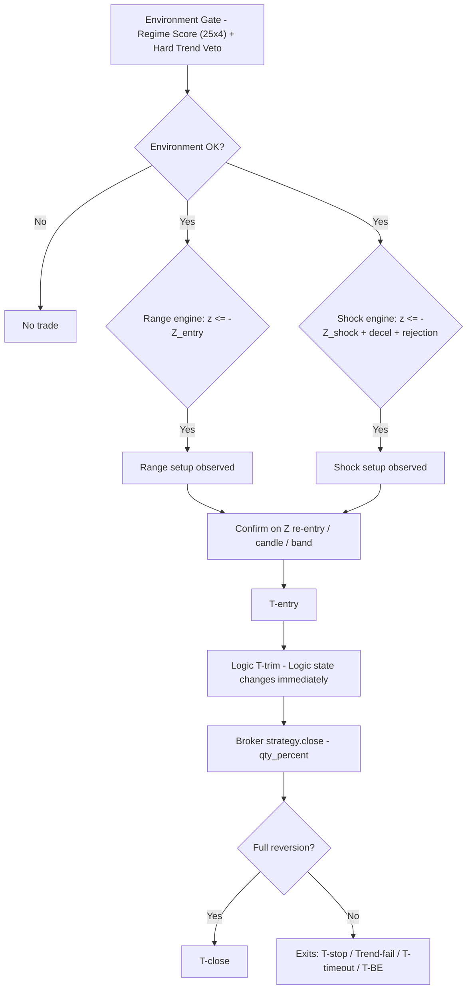

# Mean Reversion T (MR-T)

[简体中文](README.zh-CN.md) · English

A production-grade **V2 Logic-State Parity MR-T Strategy** for TradingView, written in Pine Script v6. MR-T v3.3.2 lets the V2 logic state decide every lifecycle point from a confirmed **15-minute close**, then lets Strategy Tester execute the resulting broker intent on that same close. It is designed for **15-minute charts** and **A-share T+0 style intraday trading** (做T). Bilingual runtime UI (中文 / English).

---

## Why MR-T

Most mean-reversion indicators fire a signal the moment price strays from the mean - and then get run over when the "oversold" move is actually the start of a trend. MR-T treats mean reversion as a **multi-condition, time-aware lifecycle**, not a single threshold:

- It only trades when the **environment** is actually range-like (a composite regime score on both the 1H and 15m timeframes).
- It refuses to enter when a **hard trend** is present (slope and efficiency-ratio vetoes).
- It distinguishes a **gentle drift** (Range engine) from a **violent shock that is exhausting itself** (Shock engine).
- It sizes every exit by an **Ornstein-Uhlenbeck half-life** estimate, so a trade that has gone nowhere long enough is killed on time, not left to bleed.
- It sends **real strategy orders** to the TradingView broker emulator: T-trim closes a configurable percentage, and T-close manages the remainder.

## Features

| Capability | Detail |
|---|---|
| Dual engine | Range reversion (mild Z deviation) + Shock reversal (abnormal impulse + deceleration/rejection) |
| Hard Trend Veto | 1H and 15m slope + efficiency-ratio guards against trend environments |
| Half-life time stop | OU-process half-life estimates how long a reversion should take; fallback when unmeasurable |
| Strategy Tester | Real `strategy.entry` and `strategy.close` market orders; formal P&L and positions come from Strategy Tester |
| Partial exits | Configurable `trimPct` (default 50%) for T-trim; T-close exits the remaining position |
| Cost-aware breakeven | V2 Logic BE uses commission cost from `commissionBps`; `slippageTicks` remains Broker execution diagnostics only |
| V2 Logic-State Parity lifecycle | `MRLogicState` alone decides Entry, Stop/BE, Trend Fail, Timeout, Trim, and Final at confirmed 15m closes |
| Broker execution state | `MRBrokerState` submits order intents and records actual position, average fill price, P&L, and fill diagnostics |
| Logic/Broker consistency | Classifies flat, pending, stale, mismatched, orphan, and direct-reversal states; recovery protects broker execution without rewriting Logic Events |
| No intrabar brackets | Risk/Trim/Final levels are decision thresholds, not continuously resting stop/limit orders |
| Bilingual | Panel, chart labels and error messages switch 中文 / English via the *Language* input; input labels are compile-time static, while alerts use structured dynamic messages |
| Repaint-safe | Signals gated on confirmed bars; higher-timeframe data uses the last confirmed 1H bar; trade targets are frozen at entry |
| Versioned | Semantic versioning (see `CHANGELOG.md`), version shown in the panel |

---

## Three-layer architecture

The formal script keeps three explicit responsibilities:

- **V2 Logic Layer** — `MRLogicState` is the only source for T-buy, T-short, T-trim, T-close, Stop/BE, Trend Fail, and Timeout decisions.
- **Broker Execution Layer** — `MRBrokerState` submits real `strategy.entry` / `strategy.close` orders and records actual position, fill price, Strategy Tester P&L, consistency, and recovery facts.
- **Presentation Layer** — the chart, Panel, and compact Data Window expose Logic decisions and Broker facts. Its production display footprint follows the stable 07cbe31 presentation baseline; internal transition diagnostics are covered by the harness.

Presentation never feeds back into the Logic or Broker layers. T labels and frozen target/Risk lines come from Logic State; native order markers and Broker statistics come from Strategy Tester execution.

---

## How it works

### Lifecycle (per trade)

`Observe` -> `T-buy / T-short` -> Logic `T-trim` (immediate post-trim state and BE) -> Broker partial close -> Logic `T-close` (remaining position, full reversion).
Abnormal exits: Logic `T-stop` (statistical or ATR risk line), `Trend-fail` (market turned trending), `T-timeout` (half-life exceeded), `T-BE` (breakeven after the first target).

There is no session-end liquidation. Positions and pending mean-reversion setups may naturally remain active across trading dates.

---

## Requirements

- **Pine Script v6** editor
- **15-minute chart** (enforced - the script errors on any other timeframe; this is a deliberate contract, see *Limitations*)
- A higher timeframe for market state (default **1H**)
- Data with enough history for warm-up (`meanLen` + `zLen` ~ 64 bars, half-life ~ 80 bars)

## Installation

1. Open the Pine Editor on TradingView, paste the contents of [`MRT.pine`](MRT.pine), then *Add to chart*.
2. Or clone this repo and open `MRT.pine` in your editor.

> MR-T v3 is a **strategy**, not an indicator. It creates one-direction-at-a-time orders and can be evaluated in Strategy Tester.

---

## Usage

- **Market**: primarily A-share T+0 intraday (做T) on 15m. Re-validate **all** parameters before applying to another market or timeframe.
- **Language**: set the *Language & Version -> Language* input to `zh` or `en`. This switches the panel, chart labels, and error messages. Input *labels* are bilingual-static — Pine pins their text to compile-time `const string`; alert messages use structured dynamic fields (see *Limitations*).
- **Costs**: set `commissionBps` and `slippageTicks` to match the Strategy Tester **Properties** tab. The code defaults to `3.0 bp/side` commission and `0` ticks, which are also the defaults declared in `strategy()`; `commissionBps` feeds the V2 Logic BE threshold and `slippageTicks` feeds the Broker cost estimate shown in the Panel.
- **Alerts**: use `Any alert() function call` for setup/fill lifecycle messages, or `Order fills only` with `{{strategy.order.alert_message}}` for executable order events. The built-in strategy alert template also appends `{{strategy.order.price}}` as the actual fill price. Messages include `MR-T`, direction, event, mode, and price.

### Backtest workflow

1. Add `MRT.pine` to a **15m** chart. The script intentionally errors on other chart timeframes.
2. Open **Strategy Tester -> Properties** and confirm commission is `0.03%` per order (3 bp) and slippage is `0` ticks, or change both the Properties values and the matching script inputs.
3. Confirm `Pyramiding` is `0`, `Margin for long positions` and `Margin for short positions` are `0%`, and choose the desired default order size in Properties. The script defaults to 100% of equity for a single position.
4. Verify the tester trade markers: entry fills on the same close as the confirmed signal; T-trim reduces the position by `trimPct`; T-close exits the remainder on the same close as its decision.
5. Use the chart’s Risk/Trim/Final lines and the panel’s Tester rows for inspection. Net profit, win rate, drawdown, profit factor, and trade count in Strategy Tester are the formal results.

---

## Parameter reference

Input labels are Chinese (Pine requires compile-time `const string` for input titles, so they cannot be localized by a runtime toggle). English reference below.

### 1. Trade Direction
| Input | Type | Default | Meaning |
|---|---|---|---|
| `allowLong` | bool | true | Allow long (T-buy) setups |
| `allowShort` | bool | true | Allow short (T-short) setups |

### 2. Mean & Z-score
| Input | Type | Default | Meaning |
|---|---|---|---|
| `meanLen` | int | 32 | Local mean EMA length (15m) |
| `zLen` | int | 32 | Z-score window |
| `rangeEntryZ` | float | 1.65 | Range-mode observation Z threshold |
| `shockEntryZ` | float | 2.00 | Shock-mode observation Z threshold |
| `rangePartialZ` | float | 0.80 | Range-mode trim target (in Z) |
| `rangeExitZ` | float | 0.25 | Range-mode close target (in Z) |
| `shockPartialZ` | float | 1.00 | Shock-mode trim target (in Z) |
| `shockExitZ` | float | 0.50 | Shock-mode close target (in Z) |
| `stopZ` | float | 3.25 | Extreme statistical failure (stop) Z |

### 3. 1H Market State
| Input | Type | Default | Meaning |
|---|---|---|---|
| `htfTf` | timeframe | 60 | Higher timeframe for market state |
| `htfMeanLen` | int | 20 | 1H mean EMA length |
| `htfSlopeLookback` | int | 4 | 1H slope lookback |
| `idealHtfSlope` | float | 0.10 | Max "ideal" 1H slope (ATR/bar) for scoring |
| `htfERLen` | int | 10 | 1H efficiency-ratio length |
| `idealHtfER` | float | 0.50 | Max "ideal" 1H ER for scoring |

### 4. 15m Market State
| Input | Type | Default | Meaning |
|---|---|---|---|
| `localSlopeLookback` | int | 8 | 15m slope lookback |
| `idealLocalSlope` | float | 0.12 | Max "ideal" 15m slope (ATR/bar) |
| `localERLen` | int | 16 | 15m efficiency-ratio length |
| `idealLocalER` | float | 0.60 | Max "ideal" 15m ER |

### 5. Regime Score
| Input | Type | Default | Meaning |
|---|---|---|---|
| `rangeMinScore` | float | 50 | Minimum environment score for Range mode |
| `shockMinScore` | float | 45 | Minimum environment score for Shock mode |
| `regimeSmoothLen` | int | 3 | Score smoothing window |

### 6. Hard Trend Veto
| Input | Type | Default | Meaning |
|---|---|---|---|
| `vetoHtfSlope` | float | 0.18 | 1H slope veto threshold |
| `vetoLocalSlope` | float | 0.23 | 15m slope veto threshold |
| `vetoHtfER` | float | 0.75 | 1H ER veto threshold |
| `vetoLocalER` | float | 0.80 | 15m ER veto threshold |

### 7. Shock Engine
| Input | Type | Default | Meaning |
|---|---|---|---|
| `shockLookback` | int | 2 | Bars over which shock is measured |
| `minShockATR` | float | 0.80 | Minimum shock strength (in ATR) |
| `requireShockDeceleration` | bool | true | Require the impulse to be decelerating |
| `decelerationRatio` | float | 0.85 | Deceleration ratio (current vs. previous move) |
| `requireRejection` | bool | true | Require a rejection / reverse candle |
| `minWickRatio` | float | 0.30 | Minimum wick ratio for rejection |

### 8. Half-Life / Time Stop
| Input | Type | Default | Meaning |
|---|---|---|---|
| `halfLifeLookback` | int | 80 | Half-life sample length |
| `timeStopMultiplier` | float | 3.0 | Time stop = half-life x N |
| `minTimeStopBars` | int | 8 | Minimum time stop (bars) |
| `maxTimeStopBars` | int | 40 | Maximum time stop (bars) |
| `fallbackTimeStopBars` | int | 24 | Time stop when half-life is unmeasurable |

### 9. Setup / Confirmation
| Input | Type | Default | Meaning |
|---|---|---|---|
| `rangeSetupBars` | int | 16 | Range setup validity window (bars) |
| `shockSetupBars` | int | 8 | Shock setup validity window (bars) |
| `requireCandleConfirm` | bool | true | Require candle direction confirmation |
| `requireBandReclaim` | bool | true | Require price to re-enter the active Entry-Z band in addition to Z reclaim |
| `cooldownBars` | int | 3 | Cooldown after exit |
| `trimPct` | float | 50 | Percentage of the initial position closed at T-trim |

### 10. Risk Control
| Input | Type | Default | Meaning |
|---|---|---|---|
| `atrLen` | int | 14 | ATR period |
| `hardStopATR` | float | 2.50 | ATR emergency stop |
| `stopMode` | string | Balanced | `Tight` / `Balanced` / `Loose` stop selection |
| `balancedWeight` | float | 0.50 | Weight between statistical & ATR stops (0=loose, 1=tight) |
| `moveStopToBE` | bool | true | Move stop to breakeven after trim |
| `commissionBps` | float | 3.0 | Commission per side in basis points; match Strategy Tester Properties |
| `slippageTicks` | int | 0 | Slippage per side in ticks; match Strategy Tester Properties |

### 11. Display / 12. Language
| Input | Type | Default | Meaning |
|---|---|---|---|
| `showBands` | bool | true | Show reversion bands |
| `showBackground` | bool | true | Show trade environment background |
| `showSetup` | bool | true | Show observation signals |
| `showPanel` | bool | true | Show status panel |
| `showTradeLevels` | bool | true | Show live target/risk lines |
| `lang` | string | zh | `zh` / `en` runtime UI language |

---

## Cost model & Strategy Tester panel

Strategy Tester is the formal performance source. Commission is declared as `0.03%` per order (3 bp/side) and slippage as `0` ticks by default. Change the Strategy Tester **Properties** values for a different test, then set the matching `commissionBps` and `slippageTicks` inputs so the Broker cost estimate in the Panel uses the same assumptions.

The V2 Logic State uses `logic.entryPrice = close` and `logic.cost = entryPrice * (2 * commissionBps) / 10000` for frozen targets, risk, and post-trim BE. `slippageTicks` is used only by the Broker cost estimate in the Panel; it never changes the V2 Logic BE threshold. The panel labels net profit, drawdown, closed trades, and win rate as **Tester** values. Range/Shock are lightweight Broker-side classifications shown as entries / closed positions / wins, and their win rates use `wins / closed` rather than `wins / entries`.

### v3.3.2 V2 Logic-State Parity and stable Presentation

The V2 `MRLogicState` is the only source for `T-buy`, `T-short`, `T-trim`, `T-close`, Stop, Trend Fail, Timeout, and Breakeven. On a confirmed close, it mutates immediately and emits a Broker intent. `MRBrokerState` then submits `strategy.entry` or `strategy.close` and records the actual Strategy Tester position, average fill price, P&L, and fill bars. Native Strategy Tester order markers represent Broker execution; custom T labels represent Logic Events.

`process_orders_on_close = true`, `calc_on_order_fills = true`, `calc_on_every_tick = false`, `pyramiding = 0`, and zero margin requirements preserve the same-close parity configuration. A Broker fill recalculation only synchronizes execution facts and never creates, reorders, or rewrites a Logic decision. Chart levels remain confirmed-close decision thresholds, not intrabar stop/limit orders.

v3.3.2 keeps the v3.3.1 Logic/Broker architecture and restores the stable 07cbe31 presentation footprint. The chart retains Local Mean, Range/Shock/Extreme bands and fills, Range/Shock backgrounds, frozen Logic T-trim/T-close/Risk levels, setup labels, Logic-event T labels, and the compact Panel. Active levels are shown while `logic.pos != 0`; Broker fills do not create T labels.

The production Data Window now has 27 plots: market context, the minimum Logic parity fields, current Broker position/entry facts, Broker recovery/consistency, and Range/Shock statistics. The script has 37 `plot()` calls, one `bgcolor()`, and two const-color Shock `fill()` calls (static estimate: 38/50). Fill bars, intent flags, Shock funnel counters, and other internal transitions remain in the Panel or the release harness.

### Broker consistency and recovery

`strategy.position_size`, `strategy.position_avg_price`, `strategy.closedtrades`, and Strategy Tester P&L are Broker facts. `MRBrokerState` stores order intents, actual fills, recovery diagnostics, and auxiliary statistics; it does not own `partialTaken`, `entryBar`, `lastExitBar`, active stops, or any T-point lifecycle field. The script exposes a numeric consistency classifier in the Data Window:

| Code | State | Meaning |
|---:|---|---|
| 0 | `OK_FLAT` | Broker and lifecycle are flat |
| 1 / 2 | `OK_LONG` / `OK_SHORT` | Active lifecycle and broker position agree |
| 3 | `PENDING_ENTRY` | A confirmed entry is queued or in its fill transition |
| 4 | `STALE_ACTIVE_FLAT` | Lifecycle is active while the broker is flat without a current Full Exit transition |
| 5 | `DIRECTION_MISMATCH` | Broker direction conflicts with active/pending lifecycle direction |
| 6 | `ORPHAN_BROKER` | Broker has a position with neither an active nor pending lifecycle |
| 7 | `DIRECT_REVERSAL` | The execution crossed from Long to Short or Short to Long |
| 8 / 9 | `STALE_PENDING` / `INVALID_CONTEXT` | Pending or frozen context is no longer safe to manage |

Stale context is classified without changing the Logic State. An orphan or direct-reversal broker position cancels unfilled orders and is closed with `strategy.close_all()` as `BROKER RECOVERY`; recovery never creates a T label, changes `logic.lastExitBar`, or fabricates a Logic trade. Normal lifecycle management does not use `strategy.order`, `strategy.exit`, stop/limit prices, or OCA groups. Trade lines are shown from Logic levels while the Logic position is active.

The Logic phases are: Setup → active pre-Trim → active post-Trim → flat. `logic.entryBar`, `logic.trimDecisionBar`, and `logic.exitDecisionBar` are Logic decision anchors; `broker.entryFillBar`, `broker.trimFillBar`, and `broker.fullExitFillBar` record actual Broker fills. In the parity baseline, each decision bar should equal its corresponding fill bar. `logic.entryPrice` is the V2 decision-close price used by targets, risk thresholds, and BE; `broker.brokerEntryPrice` is the actual `strategy.position_avg_price`. `logic.partialTaken` becomes true on the confirmed Logic Trim decision, and `logic.pos`/`logic.lastExitBar` change on the Logic exit decision, before Broker fill synchronization. `Consistency Recovery Count` should remain `0` for normal historical operation.

`f_logicManage()` returns one `int` action code for diagnostics (`MANAGE_NONE`, `MANAGE_STOP_BE`, `MANAGE_TREND`, `MANAGE_TIMEOUT`, `MANAGE_TRIM`, or `MANAGE_FINAL`). Logic lifecycle fields remain the source of truth for Broker order submission.

The cumulative Shock funnel is development-level diagnostic coverage in the release harness rather than permanent production Data Window plots. This keeps the formal display compact while preserving V2 parity and filter-regression checks.

---

## Repaint safety

- Setup, Entry, Stop/BE, Trend Fail, Timeout, Trim, and Final decisions are gated on the normal confirmed-bar decision phase. One bar can create at most one lifecycle decision.
- `calc_on_order_fills` executions are reserved for synchronizing actual Entry/Trim/Exit state. Historical fill executions can still have `barstate.isconfirmed = true`, so a detected broker-position change suppresses the Logic decision phase on that execution.
- Higher-timeframe values are the **last confirmed 1H bar** (`f_erPrev` / `f_slopeATRPrev` + `barmerge.lookahead_on`) - no future leak.
- The confirmed signal bar mutates Logic immediately and queues a same-close market order; V2 thresholds are frozen from `logic.entryPrice = close` and the signal-bar regime context, while `broker.brokerEntryPrice = strategy.position_avg_price` records the actual Tester fill.
- The half-life estimate uses only past data.

The confirmed Entry decision stores `logic.entryBar`; the same-close Broker Emulator fill is stored as `broker.entryFillBar`. Entry-fill recalculation only synchronizes the real price and size; the next confirmed close is the first management opportunity because Logic management requires `bar_index > logic.entryBar`. A Logic Trim decision immediately sets `logic.partialTaken`; its same-close real reduction is stored as `broker.trimFillBar`. A full-exit decision immediately sets `logic.pos = 0` and `logic.lastExitBar`; `broker.fullExitFillBar` records the later or same-close flat transition. Logic cooldown uses `logic.lastExitBar`, never Broker flatness.

### v3.3.2 TradingView validation checklist

After compiling in TradingView on a 15-minute chart:

1. Pine v6 compiles successfully on a 15m chart.
2. `MR-L` / `MR-S` fills on the same confirmed signal close; `Logic Entry Bar = Broker Entry Fill Bar`.
3. Entry fill execution only synchronizes Broker state; the Entry Logic decision bar does not trigger Trim, Stop, Trend Fail, or Timeout, and the next confirmed close is the first management bar.
4. Trim triggers only when the confirmed close reaches the frozen Trim level.
5. The real broker position is reduced by `trimPct` (default 50%).
6. Trim decision immediately sets `Logic Partial Taken = 1`; Trim fill execution only synchronizes Broker state. The Trim decision bar does not trigger BE or Final, and the next confirmed close is eligible for them.
7. Stop triggers only when the confirmed close crosses the displayed Risk level.
8. Trend Fail is evaluated only at a confirmed close.
9. Timeout is evaluated only at a confirmed close.
10. Long and Short behavior is mirrored, and positions can cross trading dates.
11. Broker Position and `MRBrokerState` fill diagnostics remain consistent through every fill; Logic position remains the lifecycle source.
12. `Logic Exit Decision Bar` and `Logic Last Exit Bar` are set before Broker flattening; `Broker Full Exit Fill Bar` records the actual flat transition.
13. `Logic Entry Price` is the decision close and `Broker Entry Price` is `strategy.position_avg_price`.
14. `Margin Call` does not occur under the parity settings, and `Consistency Recovery Count` remains `0` on normal historical paths.
15. At a final flat state, Range + Shock Entries equals Range + Shock Closed (apart from a genuinely pending order).
16. No normal order list contains `MR-L/MR-S-STOP`, `-TRIM`, or `-FINAL` bracket IDs.
17. Entry/Trim fill executions never make Logic decisions, one confirmed close never emits more than one Logic lifecycle action, and Logic Event fields persist through same-bar fill recalculation. Bar Magnifier OFF/ON should not materially alter Logic lifecycle decisions.
18. The production Data Window contains 27 plots (<= 35), and the static plot estimate is 38 (<= 50); the 07c presentation elements remain visible.

Run the local parity and presentation checks with `powershell -ExecutionPolicy Bypass -File .\tests\MRT-v3.3.2-v2-logic-parity-harness.ps1`. They cover the V2 static audit, direct v3.3.1 Logic/Broker regression comparison, confirmed-close-only Stop/Trim/Final semantics, Long/Short BE cost, lifecycle cases, the 07c presentation footprint, and the plot budget. The source-level static review and `git diff --check` do not replace TradingView compilation or Strategy Tester runtime verification.

## Limitations & scope

- **Hard-coded 15m contract.** The script refuses to run on other timeframes. This is deliberate (window lengths are in bars and were tuned on 15m); rescaling to other timeframes requires re-tuning.
- **Input labels are bilingual-static.** Pine input titles are compile-time `const string`; a runtime language toggle cannot localize them. The panel, chart labels and error messages follow the `lang` input. Strategy order messages are dynamic and the default alert template includes the actual fill-price placeholder.
- **Costs have two settings surfaces.** Pine requires the Strategy Tester commission/slippage defaults in `strategy()` to be compile-time values. `commissionBps` feeds V2 Logic cost/BE and `slippageTicks` feeds the Panel's Broker cost estimate; changing either input does not rewrite the Properties tab automatically.
- **A-shares T+0 bias.** The engine assumes intraday reversion against a held position. Applying it to trending crypto/forex without re-tuning will disappoint.
- **Not financial advice.** No performance guarantees, express or implied.

---

## Contributing

Issues and PRs welcome. Keep V2 decision fields in `MRLogicState`, execution facts in `MRBrokerState`, and bump `CHANGELOG.md` + `SCRIPT_VERSION` with each behavioral change.

## License

This Pine Script code is subject to the terms of the **Mozilla Public License 2.0** at <https://mozilla.org/MPL/2.0/>. See [LICENSE](LICENSE) for the full text.

## Author

**Jasxu** - [TradingView](https://www.tradingview.com/u/Jasxu/) · [GitHub](https://github.com/Ye-Yu-Mo)

## Disclaimer

This software is provided for **educational and informational purposes only**. It is not investment advice, and past or simulated performance does not guarantee future results. Trading involves risk; you are solely responsible for your own decisions.
