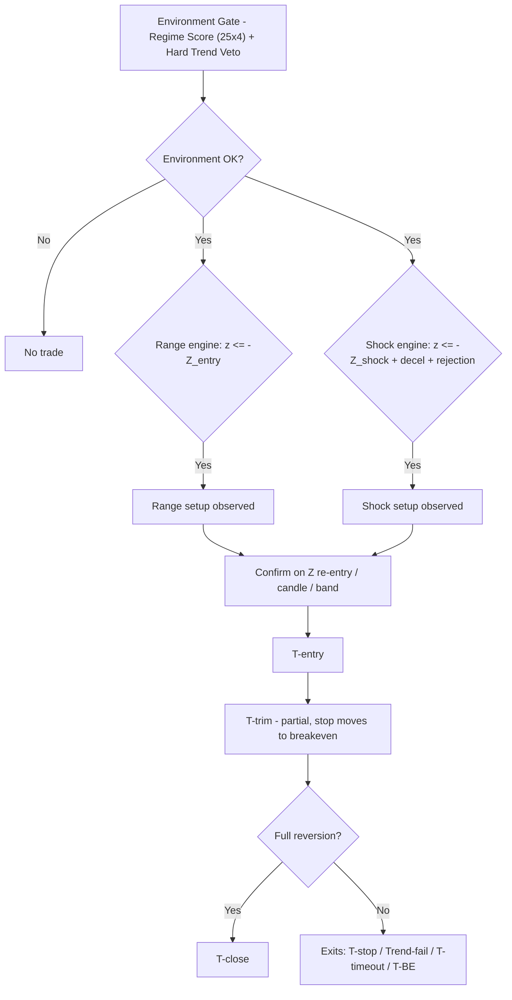

# Mean Reversion T (MR-T)

[简体中文](README.zh-CN.md) · English

A production-grade **mean-reversion "T" (intraday swing) signal indicator** for TradingView, written in Pine Script v6. Designed for **15-minute charts** and **A-share T+0 style intraday trading** (做T). Repaint-safe. Bilingual runtime UI (中文 / English).

---

## Why MR-T

Most mean-reversion indicators fire a signal the moment price strays from the mean - and then get run over when the "oversold" move is actually the start of a trend. MR-T treats mean reversion as a **multi-condition, time-aware lifecycle**, not a single threshold:

- It only trades when the **environment** is actually range-like (a composite regime score on both the 1H and 15m timeframes).
- It refuses to enter when a **hard trend** is present (slope and efficiency-ratio vetoes).
- It distinguishes a **gentle drift** (Range engine) from a **violent shock that is exhausting itself** (Shock engine).
- It sizes every exit by an **Ornstein-Uhlenbeck half-life** estimate, so a trade that has gone nowhere long enough is killed on time, not left to bleed.
- It tracks **cost-adjusted virtual P&L**, so "breakeven" actually means breakeven after fees and slippage.

## Features

| Capability | Detail |
|---|---|
| Dual engine | Range reversion (mild Z deviation) + Shock reversal (abnormal impulse + deceleration/rejection) |
| Hard Trend Veto | 1H and 15m slope + efficiency-ratio guards against trend environments |
| Half-life time stop | OU-process half-life estimates how long a reversion should take; fallback when unmeasurable |
| Cost-aware P&L | Virtual per-trade and cumulative P&L, round-trip cost deducted, shown in the panel |
| Bilingual | Panel, chart labels and error messages switch 中文 / English via the *Language* input; alert messages and input labels are bilingual-static (Pine pins those to compile-time `const string`) |
| Repaint-safe | Signals gated on confirmed bars; higher-timeframe data uses the last confirmed 1H bar; trade targets are frozen at entry |
| Versioned | Semantic versioning (see `CHANGELOG.md`), version shown in the panel |

---

## How it works

### Lifecycle (per trade)

`Observe` -> `T-buy / T-short` -> `T-trim` (partial, moves stop to breakeven) -> `T-close` (full reversion).
Abnormal exits: `T-stop` (statistical or ATR risk line), `Trend-fail` (market turned trending), `T-timeout` (half-life exceeded), `T-BE` (breakeven after the first target).

---

## Requirements

- **Pine Script v6** editor
- **15-minute chart** (enforced - the script errors on any other timeframe; this is a deliberate contract, see *Limitations*)
- A higher timeframe for market state (default **1H**)
- Data with enough history for warm-up (`meanLen` + `zLen` ~ 64 bars, half-life ~ 80 bars)

## Installation

1. Open the Pine Editor on TradingView, paste the contents of [`MRT.pine`](MRT.pine), then *Add to chart*.
2. Or clone this repo and open `MRT.pine` in your editor.

> It is an **indicator**, not a strategy - it does not place orders. Use its alerts to inform your own decisions.

---

## Usage

- **Market**: primarily A-share T+0 intraday (做T) on 15m. Re-validate **all** parameters before applying to another market or timeframe.
- **Language**: set the *Language & Version -> Language* input to `zh` or `en`. This switches the panel, chart labels, and error messages. Alert messages and input *labels* are bilingual-static — Pine pins their text to compile-time `const string` (see *Limitations*).
- **Cost**: set *Risk Control -> Cost per side (bp)* to your real round-trip cost (commission + slippage + stamp duty, per side). Default `3.0 bp/side` is a conservative estimate; it only affects the virtual P&L and breakeven offset.
- **Alerts**: 10 built-in alert conditions (`MR-T ...`) - create alerts from the Alerts panel and select an `MR-T` condition.

---

## Parameter reference

Input labels are Chinese (Pine requires compile-time `const string` for input titles, so they cannot be localized by a runtime toggle). English reference below.

### 1. Trade Direction
| Input | Type | Default | Meaning |
|---|---|---|---|
| `allowLong` | bool | true | Allow long (T-buy) setups |
| `allowShort` | bool | true | Allow short (T-short) setups |

### 2. Mean & Z-score
| Input | Type | Default | Meaning |
|---|---|---|---|
| `meanLen` | int | 32 | Local mean EMA length (15m) |
| `zLen` | int | 32 | Z-score window |
| `rangeEntryZ` | float | 1.65 | Range-mode observation Z threshold |
| `shockEntryZ` | float | 2.00 | Shock-mode observation Z threshold |
| `rangePartialZ` | float | 0.80 | Range-mode trim target (in Z) |
| `rangeExitZ` | float | 0.25 | Range-mode close target (in Z) |
| `shockPartialZ` | float | 1.00 | Shock-mode trim target (in Z) |
| `shockExitZ` | float | 0.50 | Shock-mode close target (in Z) |
| `stopZ` | float | 3.25 | Extreme statistical failure (stop) Z |

### 3. 1H Market State
| Input | Type | Default | Meaning |
|---|---|---|---|
| `htfTf` | timeframe | 60 | Higher timeframe for market state |
| `htfMeanLen` | int | 20 | 1H mean EMA length |
| `htfSlopeLookback` | int | 4 | 1H slope lookback |
| `idealHtfSlope` | float | 0.10 | Max "ideal" 1H slope (ATR/bar) for scoring |
| `htfERLen` | int | 10 | 1H efficiency-ratio length |
| `idealHtfER` | float | 0.50 | Max "ideal" 1H ER for scoring |

### 4. 15m Market State
| Input | Type | Default | Meaning |
|---|---|---|---|
| `localSlopeLookback` | int | 8 | 15m slope lookback |
| `idealLocalSlope` | float | 0.12 | Max "ideal" 15m slope (ATR/bar) |
| `localERLen` | int | 16 | 15m efficiency-ratio length |
| `idealLocalER` | float | 0.60 | Max "ideal" 15m ER |

### 5. Regime Score
| Input | Type | Default | Meaning |
|---|---|---|---|
| `rangeMinScore` | float | 50 | Minimum environment score for Range mode |
| `shockMinScore` | float | 45 | Minimum environment score for Shock mode |
| `regimeSmoothLen` | int | 3 | Score smoothing window |

### 6. Hard Trend Veto
| Input | Type | Default | Meaning |
|---|---|---|---|
| `vetoHtfSlope` | float | 0.18 | 1H slope veto threshold |
| `vetoLocalSlope` | float | 0.23 | 15m slope veto threshold |
| `vetoHtfER` | float | 0.75 | 1H ER veto threshold |
| `vetoLocalER` | float | 0.80 | 15m ER veto threshold |

### 7. Shock Engine
| Input | Type | Default | Meaning |
|---|---|---|---|
| `shockLookback` | int | 2 | Bars over which shock is measured |
| `minShockATR` | float | 0.80 | Minimum shock strength (in ATR) |
| `requireShockDeceleration` | bool | true | Require the impulse to be decelerating |
| `decelerationRatio` | float | 0.85 | Deceleration ratio (current vs. previous move) |
| `requireRejection` | bool | true | Require a rejection / reverse candle |
| `minWickRatio` | float | 0.30 | Minimum wick ratio for rejection |

### 8. Half-Life / Time Stop
| Input | Type | Default | Meaning |
|---|---|---|---|
| `halfLifeLookback` | int | 80 | Half-life sample length |
| `timeStopMultiplier` | float | 3.0 | Time stop = half-life x N |
| `minTimeStopBars` | int | 8 | Minimum time stop (bars) |
| `maxTimeStopBars` | int | 40 | Maximum time stop (bars) |
| `fallbackTimeStopBars` | int | 24 | Time stop when half-life is unmeasurable |

### 9. Setup / Confirmation
| Input | Type | Default | Meaning |
|---|---|---|---|
| `rangeSetupBars` | int | 16 | Range setup validity window (bars) |
| `shockSetupBars` | int | 8 | Shock setup validity window (bars) |
| `requireCandleConfirm` | bool | true | Require candle direction confirmation |
| `requireBandReclaim` | bool | true | Require price to re-enter the Z band |
| `cooldownBars` | int | 3 | Cooldown after exit |

### 10. Risk Control
| Input | Type | Default | Meaning |
|---|---|---|---|
| `atrLen` | int | 14 | ATR period |
| `hardStopATR` | float | 2.50 | ATR emergency stop |
| `stopMode` | string | Balanced | `Tight` / `Balanced` / `Loose` stop selection |
| `balancedWeight` | float | 0.50 | Weight between statistical & ATR stops (0=loose, 1=tight) |
| `moveStopToBE` | bool | true | Move stop to breakeven after trim |
| `costBps` | float | 3.0 | Round-trip cost per side (bp) - P&L and BE offset |

### 11. Display / 12. Language
| Input | Type | Default | Meaning |
|---|---|---|---|
| `showBands` | bool | true | Show reversion bands |
| `showBackground` | bool | true | Show trade environment background |
| `showSetup` | bool | true | Show observation signals |
| `showPanel` | bool | true | Show status panel |
| `showTradeLevels` | bool | true | Show live target/risk lines |
| `lang` | string | zh | `zh` / `en` runtime UI language |

---

## Cost model & P&L panel

The panel (right-top) reports, for the most recent closed trade and cumulatively:

- **Last P&L** - net P&L of the last trade in `ATR` units and `%`, after deducting `2 x costBps` round-trip cost.
- **Cum P&L** - cumulative net P&L in `ATR` units and the number of closed virtual trades.

Breakeven (after a trim) is placed at `entry +/- round-trip cost`, so a "T-BE" exit is genuinely flat after costs.

**Honest limitations of the model:**

- Exits are evaluated on **bar close**, not intrabar - a real stop can be hit and recovered within the same bar; this indicator reports on close.
- P&L is computed on the **full position** from entry to exit and ignores the size weighting of the trim step.
- Costs are a flat bps estimate; real fills vary. Treat the panel as a sanity signal, not an accounting system.

---

## Repaint safety

- All signal/event writes are gated on `barstate.isconfirmed`.
- Higher-timeframe values are the **last confirmed 1H bar** (`f_erPrev` / `f_slopeATRPrev` + `barmerge.lookahead_on`) - no future leak.
- Targets/stops are **frozen at entry** (the trade context in `MRState`).
- The half-life estimate uses only past data.

## Limitations & scope

- **Hard-coded 15m contract.** The script refuses to run on other timeframes. This is deliberate (window lengths are in bars and were tuned on 15m); rescaling to other timeframes requires re-tuning.
- **Input labels and alert messages are bilingual-static.** Pine input titles and `alertcondition` messages are compile-time `const string`; a runtime language toggle cannot localize them, so they ship with both languages baked in. The panel, chart labels and error messages follow the `lang` input.
- **A-shares T+0 bias.** The engine assumes intraday reversion against a held position. Applying it to trending crypto/forex without re-tuning will disappoint.
- **Not financial advice.** No performance guarantees, express or implied.

---

## Contributing

Issues and PRs welcome. Keep changes backward-compatible, keep the state machine centralized in `MRState`, and bump `CHANGELOG.md` + `SCRIPT_VERSION` with each behavioral change.

## License

This Pine Script code is subject to the terms of the **Mozilla Public License 2.0** at <https://mozilla.org/MPL/2.0/>. See [LICENSE](LICENSE) for the full text.

## Author

**Jasxu** - [TradingView](https://www.tradingview.com/u/Jasxu/) · [GitHub](https://github.com/Ye-Yu-Mo)

## Disclaimer

This software is provided for **educational and informational purposes only**. It is not investment advice, and past or simulated performance does not guarantee future results. Trading involves risk; you are solely responsible for your own decisions.
