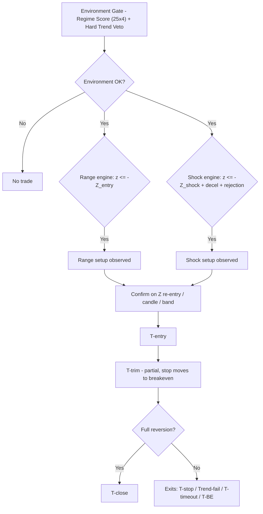

# Mean Reversion T (MR-T)

[简体中文](README.zh-CN.md) · English

A production-grade **mean-reversion "T" strategy** for TradingView, written in Pine Script v6. MR-T v3 is a directly backtestable `strategy()` with real Strategy Tester orders, designed for **15-minute charts** and **A-share T+0 style intraday trading** (做T). Repaint-safe signal logic. Bilingual runtime UI (中文 / English).

---

## Why MR-T

Most mean-reversion indicators fire a signal the moment price strays from the mean - and then get run over when the "oversold" move is actually the start of a trend. MR-T treats mean reversion as a **multi-condition, time-aware lifecycle**, not a single threshold:

- It only trades when the **environment** is actually range-like (a composite regime score on both the 1H and 15m timeframes).
- It refuses to enter when a **hard trend** is present (slope and efficiency-ratio vetoes).
- It distinguishes a **gentle drift** (Range engine) from a **violent shock that is exhausting itself** (Shock engine).
- It sizes every exit by an **Ornstein-Uhlenbeck half-life** estimate, so a trade that has gone nowhere long enough is killed on time, not left to bleed.
- It sends **real strategy orders** to the TradingView broker emulator: T-trim closes a configurable percentage, and T-close manages the remainder.

## Features

| Capability | Detail |
|---|---|
| Dual engine | Range reversion (mild Z deviation) + Shock reversal (abnormal impulse + deceleration/rejection) |
| Hard Trend Veto | 1H and 15m slope + efficiency-ratio guards against trend environments |
| Half-life time stop | OU-process half-life estimates how long a reversion should take; fallback when unmeasurable |
| Strategy Tester | Real `strategy.entry`, OCA price exits, and `strategy.close` market exits; formal P&L comes from Strategy Tester |
| Partial exits | Configurable `trimPct` (default 50%) for T-trim; T-close exits the remaining position |
| Cost-aware breakeven | Strategy Tester commission/slippage are the formal cost source; matching inputs size the post-trim breakeven estimate |
| Intrabar fill state | A dedicated `varip` fill state tracks real position transitions across repeated `calc_on_order_fills` executions without changing signal rules |
| Broker/fill-state consistency | Classifies flat, pending, stale, mismatched, orphan, and direct-reversal states; invalid contexts are cleared or safely closed |
| Protective quantity guards | STOP/TRIM/FINAL quantities are capped by the current `strategy.position_size`, preventing stale entry size from creating a reversal |
| Bilingual | Panel, chart labels and error messages switch 中文 / English via the *Language* input; input labels are compile-time static, while alerts use structured dynamic messages |
| Repaint-safe | Signals gated on confirmed bars; higher-timeframe data uses the last confirmed 1H bar; trade targets are frozen at entry |
| Versioned | Semantic versioning (see `CHANGELOG.md`), version shown in the panel |

---

## How it works

### Lifecycle (per trade)

`Observe` -> `T-buy / T-short` -> `T-trim` (real partial exit, moves the remaining stop to breakeven) -> `T-close` (remaining position, full reversion).
Abnormal exits: `T-stop` (statistical or ATR risk line), `Trend-fail` (market turned trending), `T-timeout` (half-life exceeded), `T-BE` (breakeven after the first target).

There is no session-end liquidation. Positions and pending mean-reversion setups may naturally remain active across trading dates.

---

## Requirements

- **Pine Script v6** editor
- **15-minute chart** (enforced - the script errors on any other timeframe; this is a deliberate contract, see *Limitations*)
- A higher timeframe for market state (default **1H**)
- Data with enough history for warm-up (`meanLen` + `zLen` ~ 64 bars, half-life ~ 80 bars)

## Installation

1. Open the Pine Editor on TradingView, paste the contents of [`MRT.pine`](MRT.pine), then *Add to chart*.
2. Or clone this repo and open `MRT.pine` in your editor.

> MR-T v3 is a **strategy**, not an indicator. It creates one-direction-at-a-time orders and can be evaluated in Strategy Tester.

---

## Usage

- **Market**: primarily A-share T+0 intraday (做T) on 15m. Re-validate **all** parameters before applying to another market or timeframe.
- **Language**: set the *Language & Version -> Language* input to `zh` or `en`. This switches the panel, chart labels, and error messages. Input *labels* are bilingual-static — Pine pins their text to compile-time `const string`; alert messages use structured dynamic fields (see *Limitations*).
- **Costs**: set `commissionBps` and `slippageTicks` to match the Strategy Tester **Properties** tab. The code defaults to `3.0 bp/side` commission and `0` ticks, which are also the defaults declared in `strategy()`; the inputs are used for the post-trim breakeven estimate.
- **Alerts**: use `Any alert() function call` for setup/fill lifecycle messages, or `Order fills only` with `{{strategy.order.alert_message}}` for executable order events. The built-in strategy alert template also appends `{{strategy.order.price}}` as the actual fill price. Messages include `MR-T`, direction, event, mode, and price.

### Backtest workflow

1. Add `MRT.pine` to a **15m** chart. The script intentionally errors on other chart timeframes.
2. Open **Strategy Tester -> Properties** and confirm commission is `0.03%` per order (3 bp) and slippage is `0` ticks, or change both the Properties values and the matching script inputs.
3. Confirm `Pyramiding` is `0` and choose the desired default order size in Properties. The script defaults to 100% of equity for a single position.
4. Verify the tester trade markers: entry fills on the next available tick after a confirmed signal; T-trim reduces the position by `trimPct`; T-close exits the remainder.
5. Use the chart’s Risk/Trim/Final lines and the panel’s Tester rows for inspection. Net profit, win rate, drawdown, profit factor, and trade count in Strategy Tester are the formal results.

---

## Parameter reference

Input labels are Chinese (Pine requires compile-time `const string` for input titles, so they cannot be localized by a runtime toggle). English reference below.

### 1. Trade Direction
| Input | Type | Default | Meaning |
|---|---|---|---|
| `allowLong` | bool | true | Allow long (T-buy) setups |
| `allowShort` | bool | true | Allow short (T-short) setups |

### 2. Mean & Z-score
| Input | Type | Default | Meaning |
|---|---|---|---|
| `meanLen` | int | 32 | Local mean EMA length (15m) |
| `zLen` | int | 32 | Z-score window |
| `rangeEntryZ` | float | 1.65 | Range-mode observation Z threshold |
| `shockEntryZ` | float | 2.00 | Shock-mode observation Z threshold |
| `rangePartialZ` | float | 0.80 | Range-mode trim target (in Z) |
| `rangeExitZ` | float | 0.25 | Range-mode close target (in Z) |
| `shockPartialZ` | float | 1.00 | Shock-mode trim target (in Z) |
| `shockExitZ` | float | 0.50 | Shock-mode close target (in Z) |
| `stopZ` | float | 3.25 | Extreme statistical failure (stop) Z |

### 3. 1H Market State
| Input | Type | Default | Meaning |
|---|---|---|---|
| `htfTf` | timeframe | 60 | Higher timeframe for market state |
| `htfMeanLen` | int | 20 | 1H mean EMA length |
| `htfSlopeLookback` | int | 4 | 1H slope lookback |
| `idealHtfSlope` | float | 0.10 | Max "ideal" 1H slope (ATR/bar) for scoring |
| `htfERLen` | int | 10 | 1H efficiency-ratio length |
| `idealHtfER` | float | 0.50 | Max "ideal" 1H ER for scoring |

### 4. 15m Market State
| Input | Type | Default | Meaning |
|---|---|---|---|
| `localSlopeLookback` | int | 8 | 15m slope lookback |
| `idealLocalSlope` | float | 0.12 | Max "ideal" 15m slope (ATR/bar) |
| `localERLen` | int | 16 | 15m efficiency-ratio length |
| `idealLocalER` | float | 0.60 | Max "ideal" 15m ER |

### 5. Regime Score
| Input | Type | Default | Meaning |
|---|---|---|---|
| `rangeMinScore` | float | 50 | Minimum environment score for Range mode |
| `shockMinScore` | float | 45 | Minimum environment score for Shock mode |
| `regimeSmoothLen` | int | 3 | Score smoothing window |

### 6. Hard Trend Veto
| Input | Type | Default | Meaning |
|---|---|---|---|
| `vetoHtfSlope` | float | 0.18 | 1H slope veto threshold |
| `vetoLocalSlope` | float | 0.23 | 15m slope veto threshold |
| `vetoHtfER` | float | 0.75 | 1H ER veto threshold |
| `vetoLocalER` | float | 0.80 | 15m ER veto threshold |

### 7. Shock Engine
| Input | Type | Default | Meaning |
|---|---|---|---|
| `shockLookback` | int | 2 | Bars over which shock is measured |
| `minShockATR` | float | 0.80 | Minimum shock strength (in ATR) |
| `requireShockDeceleration` | bool | true | Require the impulse to be decelerating |
| `decelerationRatio` | float | 0.85 | Deceleration ratio (current vs. previous move) |
| `requireRejection` | bool | true | Require a rejection / reverse candle |
| `minWickRatio` | float | 0.30 | Minimum wick ratio for rejection |

### 8. Half-Life / Time Stop
| Input | Type | Default | Meaning |
|---|---|---|---|
| `halfLifeLookback` | int | 80 | Half-life sample length |
| `timeStopMultiplier` | float | 3.0 | Time stop = half-life x N |
| `minTimeStopBars` | int | 8 | Minimum time stop (bars) |
| `maxTimeStopBars` | int | 40 | Maximum time stop (bars) |
| `fallbackTimeStopBars` | int | 24 | Time stop when half-life is unmeasurable |

### 9. Setup / Confirmation
| Input | Type | Default | Meaning |
|---|---|---|---|
| `rangeSetupBars` | int | 16 | Range setup validity window (bars) |
| `shockSetupBars` | int | 8 | Shock setup validity window (bars) |
| `requireCandleConfirm` | bool | true | Require candle direction confirmation |
| `requireBandReclaim` | bool | true | Require residual/price movement toward the mean in addition to Z reclaim |
| `cooldownBars` | int | 3 | Cooldown after exit |
| `trimPct` | float | 50 | Percentage of the initial position closed at T-trim |

### 10. Risk Control
| Input | Type | Default | Meaning |
|---|---|---|---|
| `atrLen` | int | 14 | ATR period |
| `hardStopATR` | float | 2.50 | ATR emergency stop |
| `stopMode` | string | Balanced | `Tight` / `Balanced` / `Loose` stop selection |
| `balancedWeight` | float | 0.50 | Weight between statistical & ATR stops (0=loose, 1=tight) |
| `moveStopToBE` | bool | true | Move stop to breakeven after trim |
| `commissionBps` | float | 3.0 | Commission per side in basis points; match Strategy Tester Properties |
| `slippageTicks` | int | 0 | Slippage per side in ticks; match Strategy Tester Properties |

### 11. Display / 12. Language
| Input | Type | Default | Meaning |
|---|---|---|---|
| `showBands` | bool | true | Show reversion bands |
| `showBackground` | bool | true | Show trade environment background |
| `showSetup` | bool | true | Show observation signals |
| `showPanel` | bool | true | Show status panel |
| `showTradeLevels` | bool | true | Show live target/risk lines |
| `lang` | string | zh | `zh` / `en` runtime UI language |

---

## Cost model & Strategy Tester panel

Strategy Tester is the formal performance source. Commission is declared as `0.03%` per order (3 bp/side) and slippage as `0` ticks by default. Change the Strategy Tester **Properties** values for a different test, then set the matching `commissionBps` and `slippageTicks` inputs so the post-trim breakeven estimate uses the same assumptions.

After a real T-trim fill, the remaining stop is moved to `entry +/- transaction cost` when `moveStopToBE` is enabled. The panel labels net profit, drawdown, closed trades, and win rate as **Tester** values; it does not use the former virtual P&L counters. Range/Shock are lightweight auxiliary classifications shown as entries / closed positions / wins, and their win rates use `wins / closed` rather than `wins / entries`.

The broker emulator uses standard order handling. Price orders can fill at better or worse prices than their requested levels, and market orders from Trend Fail/Timeout fill on the next available tick.

### v3.0.3 broker/fill-state consistency

`strategy.position_size` and `strategy.position_avg_price` are the broker emulator’s source of truth. `MRFillState` only stores the frozen signal context, lifecycle phase, exit reason, and auxiliary statistics. The script exposes a numeric consistency classifier in the Data Window:

| Code | State | Meaning |
|---:|---|---|
| 0 | `OK_FLAT` | Broker and lifecycle are flat |
| 1 / 2 | `OK_LONG` / `OK_SHORT` | Active lifecycle and broker position agree |
| 3 | `PENDING_ENTRY` | A confirmed entry is queued or in its fill transition |
| 4 | `STALE_ACTIVE_FLAT` | Lifecycle is active while the broker is flat without a current Full Exit transition |
| 5 | `DIRECTION_MISMATCH` | Broker direction conflicts with active/pending lifecycle direction |
| 6 | `ORPHAN_BROKER` | Broker has a position with neither an active nor pending lifecycle |
| 7 | `DIRECT_REVERSAL` | The execution crossed from Long to Short or Short to Long |
| 8 / 9 | `STALE_PENDING` / `INVALID_CONTEXT` | Pending or frozen context is no longer safe to manage |

Stale context is cleared without incrementing Range/Shock Closed or Wins. An orphan or direct-reversal broker position cancels all unfilled MR orders and is closed with `strategy.close_all()`; it is never initialized as a new trade from current mean/std values. Protective orders continue to use the staged `strategy.order` + `strategy.oca.reduce` structure because the first phase needs a full-position STOP and a partial TRIM at the same time. Every submitted STOP/TRIM/FINAL qty is clamped to the current absolute broker position, and trade lines are shown only when `tradeContextValid` is true.

The numeric `Latest Closed Exit ID Code` is `1 = MR-L-TRIM`, `2 = MR-S-TRIM`, `3 = MR-L-FINAL`, `4 = MR-S-FINAL`, `5 = another/unknown exit`, and `0 = none observed`.

The panel shows `Broker Position`, `Broker Avg Price`, `FillState Position`, and `Consistency`. A short whose current market price is materially above its Risk line, or a long whose current market price is materially below its Risk line, must not remain as an old Strategy Tester position; it must have exited at the protective order or entered the explicit recovery path.

---

## Repaint safety

- Setup, entry, Trend-fail, and Timeout decisions are gated on the normal confirmed-bar decision phase; fill/exit events are emitted from actual strategy state changes.
- `calc_on_order_fills` executions are reserved for synchronizing actual Entry/Trim/Exit state and maintaining protective orders. Historical fill executions can still have `barstate.isconfirmed = true`, so that flag is not used by itself to identify a normal bar-close decision.
- Higher-timeframe values are the **last confirmed 1H bar** (`f_erPrev` / `f_slopeATRPrev` + `barmerge.lookahead_on`) - no future leak.
- The confirmed signal bar queues an order; after the fill, targets/stops are **frozen from the actual `strategy.position_avg_price`** and the signal-bar regime context.
- The half-life estimate uses only past data.

The strategy uses `calc_on_order_fills = true` so it can place the first protective price orders immediately after the broker emulator exposes the actual fill average. A fill recalculation cannot create a new setup or entry, or trigger Trend-fail/Timeout from the current bar’s final OHLC values. Historical results should still be checked with the Strategy Tester’s order-fill assumptions and Bar Magnifier settings.

### v3.0.3 TradingView validation checklist

After compiling in TradingView on a 15-minute chart:

1. Verify normal Long and Short entries.
2. Confirm that a protective STOP and TRIM order appear immediately after Entry fill.
3. Find an Entry -> Trim same-bar case and confirm the original entry price, size, mode, frozen mean/std/ATR, and targets remain unchanged.
4. Find an Entry -> Stop same-bar case and confirm the trade resets without a stuck pending entry.
5. Find a Trim -> BE same-bar case and confirm the exit is labeled Breakeven, not a plain Stop.
6. Confirm Range/Shock Entries and Closed counts increase once per complete lifecycle, even when the Tester shows partial-trade fragments.
7. Confirm the trade mode is initialized once and remains stable through all fills.
8. Confirm Final is not submitted on the Trim bar and is eligible starting on the next bar.
9. Compare `strategy.position_size`, Range/Shock counts, Trim/Exit labels, and the order list against the Data Window fields: Previous Execution Position Size, Current Strategy Position Size, Fill Event Type, Intrabar Trade Active, and Intrabar Partial Taken.
10. Confirm Data Window also reports FillState Direction, Consistency State, Direction Reversal Detected, Consistency Recovery Count, Active STOP/TRIM/FINAL Qty, and Latest Closed Exit ID Code.
11. Force or locate stale active-flat, orphan broker, and `-100 -> +20` / `+100 -> -20` transitions; confirm `STATE ERROR`, no stale trade lines, no old lifecycle reinitialization, and no direct reversal remains open.
12. For a Short, move price clearly above Risk; for a Long, move price clearly below Risk. Confirm the Strategy Tester position exits rather than remaining in the old T state.
13. Compare results with Bar Magnifier OFF and ON.

The source-level static review and `git diff --check` do not replace TradingView compilation or Strategy Tester runtime verification.

## Limitations & scope

- **Hard-coded 15m contract.** The script refuses to run on other timeframes. This is deliberate (window lengths are in bars and were tuned on 15m); rescaling to other timeframes requires re-tuning.
- **Input labels are bilingual-static.** Pine input titles are compile-time `const string`; a runtime language toggle cannot localize them. The panel, chart labels and error messages follow the `lang` input. Strategy order messages are dynamic and the default alert template includes the actual fill-price placeholder.
- **Costs have two settings surfaces.** Pine requires the Strategy Tester commission/slippage defaults in `strategy()` to be compile-time values. The `commissionBps` and `slippageTicks` inputs keep BE calculations aligned, but changing them does not rewrite the Properties tab automatically.
- **A-shares T+0 bias.** The engine assumes intraday reversion against a held position. Applying it to trending crypto/forex without re-tuning will disappoint.
- **Not financial advice.** No performance guarantees, express or implied.

---

## Contributing

Issues and PRs welcome. Keep changes backward-compatible, keep confirmed-bar state in `MRState` and fill lifecycle state in `MRFillState`, and bump `CHANGELOG.md` + `SCRIPT_VERSION` with each behavioral change.

## License

This Pine Script code is subject to the terms of the **Mozilla Public License 2.0** at <https://mozilla.org/MPL/2.0/>. See [LICENSE](LICENSE) for the full text.

## Author

**Jasxu** - [TradingView](https://www.tradingview.com/u/Jasxu/) · [GitHub](https://github.com/Ye-Yu-Mo)

## Disclaimer

This software is provided for **educational and informational purposes only**. It is not investment advice, and past or simulated performance does not guarantee future results. Trading involves risk; you are solely responsible for your own decisions.
