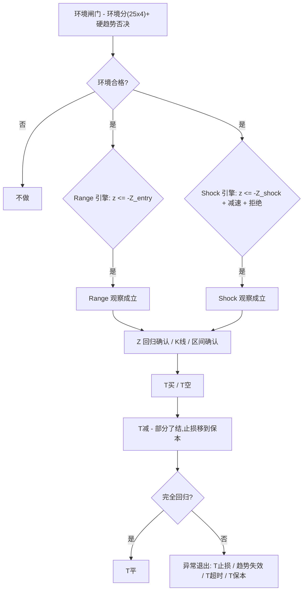

# Mean Reversion T (MR-T)

English · [简体中文](README.zh-CN.md)

一个运行于 TradingView 的生产级 **V2 Decision-Parity MR-T Strategy**,用 Pine Script v6 编写。MR-T v3.2.0 的全部生命周期决策都来自已确认的 **15 分钟收盘**,随后由 Strategy Tester 在同一根 K 线收盘执行真实市场订单。面向 **A 股 T+0 日内做T**,运行时界面中英双语。

---

## 为什么需要 MR-T

多数均值回归指标在价格一偏离均值就触发信号,然后被"超卖其实只是趋势起点"的行情碾过去。MR-T 把均值回归当作**多条件、带计时器的生命周期**,而不是单一阈值:

- 只在**环境确实适合震荡**时才交易(1H 与 15m 两个周期的综合环境分)。
- 存在**硬趋势**时拒绝进场(斜率 + 效率比率双重否决)。
- 区分**温和漂移**(Range 引擎)与**正在衰竭的异常冲击**(Shock 引擎)。
- 用 **Ornstein-Uhlenbeck 半衰期**估计每笔交易的合理时长,长时间走不出结果就按时间止损,不任其流血。
- 向 TradingView Broker Emulator 发送**真实策略订单**:T减平掉可配置比例,T平管理剩余仓位。

## 特性

| 能力 | 说明 |
|---|---|
| 双引擎 | Range 回归(温和 Z 偏离)+ Shock 反转(异常冲击 + 减速/拒绝) |
| 硬趋势否决 | 1H 与 15m 的斜率 + 效率比率守卫,拒绝趋势环境 |
| 半衰期计时 | OU 过程半衰期估计回归应耗时多久;无法估计时退化为固定值 |
| Strategy Tester | 真实 `strategy.entry` 与 `strategy.close` 市场订单;正式 P&L 与仓位来自 Strategy Tester |
| 真实分批退出 | `trimPct` 控制 T减比例(默认 50%);T平退出剩余仓位 |
| 成本感知保本 | Strategy Tester 手续费/滑点是正式成本来源;匹配输入用于计算 T减后的保本位 |
| V2 Decision-Parity 生命周期 | Entry、Stop/BE、Trend Fail、Timeout、Trim、Final 都只在 confirmed 15m close 决策,并使用同收盘市场成交 |
| Broker 成交状态 | 专用 `varip` fill state 在 `calc_on_order_fills` execution 间同步真实仓位变化,不产生新决策 |
| Broker / FillState 一致性 | 分类空仓、等待成交、stale、方向冲突、孤儿仓位与直接反向;无效上下文会清理或安全平仓 |
| 无盘中 bracket | Risk/T减/T平 水平只是收盘决策阈值,不是持续挂出的 stop/limit 订单 |
| 中英双语 | 面板 / 图表标签 / 报错随 *语言* 输入切换;输入项标签是编译期静态文本,策略警报使用结构化动态消息 |
| 防重绘 | 信号门控于已确认 K 线;高周期数据取上一根已确认的 1H bar;目标价进场时冻结 |
| 版本化 | 语义化版本(见 `CHANGELOG.md`),版本号显示在面板 |

---

## 工作原理

### 生命周期(每笔)

`观察` → `T买 / T空` → `T减`(真实部分退出,剩余止损上移保本)→ `T平`(退出剩余仓位,完全回归)。
异常退出:`T止损`(统计或 ATR 风险线)、`趋势失效`(市场转为趋势)、`T超时`(超过半衰期)、`T保本`(首目标后触发)。

策略没有日终强制清仓。持仓与等待均值回归的 Setup 可以自然跨越交易日。

---

## 环境要求

- **Pine Script v6** 编辑器
- **15 分钟图**(脚本强制校验,其它周期直接报错;这是刻意的契约,见 *局限*)
- 一个用于市场状态的高周期(默认 **1H**)
- 足够的历史数据完成预热(`meanLen` + `zLen` 约 64 根,半衰期约 80 根)

## 安装

1. 打开 TradingView Pine 编辑器,粘贴 [`MRT.pine`](MRT.pine) 内容,*添加到图表*。
2. 或 clone 本仓库,用编辑器打开 `MRT.pine`。

> MR-T v3 是 **strategy**,不是 indicator —— 会维护单方向仓位并可在 Strategy Tester 中回测。

---

## 使用

- **市场**:主要用于 A 股 T+0 日内做T,15 分钟周期。换品种 / 周期前必须**重新评估全部参数**。
- **语言**:将 *⑫ 语言与版本 → 语言* 设为 `zh` 或 `en`,切换面板、图表标签与报错。输入项*标签*为双语静态文本(Pine 限制),策略警报使用结构化动态文本(见 *局限*)。
- **成本**:将 `commissionBps` 与 `slippageTicks` 设为和 Strategy Tester **Properties** 一致。代码默认每边手续费 `3.0 bp`、滑点 `0` tick,`strategy()` 中的默认值也相同;输入用于 T减后的保本估算。
- **警报**:使用 `Any alert() function call` 接收观察/成交生命周期消息,或使用 `Order fills only` 配合 `{{strategy.order.alert_message}}` 接收可执行订单事件。消息包含 `MR-T`、方向、事件、模式与价格。

### 回测流程

1. 将 `MRT.pine` 添加到 **15m** 图表。脚本会拒绝其它图表周期。
2. 打开 **Strategy Tester -> Properties**,确认手续费为每笔订单 `0.03%`(3 bp),滑点为 `0` tick;若修改,同步修改代码输入。
3. 确认 `Pyramiding` 为 `0`,`Margin for long positions` 与 `Margin for short positions` 为 `0%`,并在 Properties 选择默认订单大小。脚本默认单仓位使用 100% equity。
4. 检查策略成交标记:Entry 在 confirmed signal 同一收盘成交;T减按 `trimPct` 减少仓位;T平在对应决策同一收盘退出剩余仓位。
5. 用图表上的 Risk/T减/T平线与面板中的 Tester 行检查状态。Strategy Tester 中的净利润、胜率、回撤、Profit Factor 和交易数量才是正式结果。

---

## 参数对照表

输入项标签为中文(Pine 的 input 标题要求编译期 `const string`,无法用运行时开关本地化)。下表为英文对照。

### ① 交易方向
| 输入 | 类型 | 默认 | 含义 |
|---|---|---|---|
| `allowLong` | bool | true | 允许 T买 |
| `allowShort` | bool | true | 允许 T空 |

### ② 均值与 Z-score
| 输入 | 类型 | 默认 | 含义 |
|---|---|---|---|
| `meanLen` | int | 32 | 15m 局部均值 EMA 长度 |
| `zLen` | int | 32 | Z-score 窗口 |
| `rangeEntryZ` | float | 1.65 | Range 模式观察 Z |
| `shockEntryZ` | float | 2.00 | Shock 模式观察 Z |
| `rangePartialZ` | float | 0.80 | Range T减目标 Z |
| `rangeExitZ` | float | 0.25 | Range T平目标 Z |
| `shockPartialZ` | float | 1.00 | Shock T减目标 Z |
| `shockExitZ` | float | 0.50 | Shock T平目标 Z |
| `stopZ` | float | 3.25 | 极端统计失效 Z |

### ③ 1H 市场状态
| 输入 | 类型 | 默认 | 含义 |
|---|---|---|---|
| `htfTf` | timeframe | 60 | 市场状态高周期 |
| `htfMeanLen` | int | 20 | 1H 均值 EMA 长度 |
| `htfSlopeLookback` | int | 4 | 1H 斜率周期 |
| `idealHtfSlope` | float | 0.10 | 1H "理想"最大斜率(ATR/Bar) |
| `htfERLen` | int | 10 | 1H 效率比率周期 |
| `idealHtfER` | float | 0.50 | 1H "理想"最大 ER |

### ④ 15m 市场状态
| 输入 | 类型 | 默认 | 含义 |
|---|---|---|---|
| `localSlopeLookback` | int | 8 | 15m 斜率周期 |
| `idealLocalSlope` | float | 0.12 | 15m "理想"最大斜率(ATR/Bar) |
| `localERLen` | int | 16 | 15m 效率比率周期 |
| `idealLocalER` | float | 0.60 | 15m "理想"最大 ER |

### ⑤ Regime Score
| 输入 | 类型 | 默认 | 含义 |
|---|---|---|---|
| `rangeMinScore` | float | 50 | Range 模式最低环境分 |
| `shockMinScore` | float | 45 | Shock 模式最低环境分 |
| `regimeSmoothLen` | int | 3 | 环境分平滑周期 |

### ⑥ Hard Trend Veto
| 输入 | 类型 | 默认 | 含义 |
|---|---|---|---|
| `vetoHtfSlope` | float | 0.18 | 1H 斜率否决阈值 |
| `vetoLocalSlope` | float | 0.23 | 15m 斜率否决阈值 |
| `vetoHtfER` | float | 0.75 | 1H ER 否决阈值 |
| `vetoLocalER` | float | 0.80 | 15m ER 否决阈值 |

### ⑦ Shock Engine
| 输入 | 类型 | 默认 | 含义 |
|---|---|---|---|
| `shockLookback` | int | 2 | 冲击测量 K 数 |
| `minShockATR` | float | 0.80 | 最小冲击强度(ATR) |
| `requireShockDeceleration` | bool | true | 要求冲击减速 |
| `decelerationRatio` | float | 0.85 | 减速比例(当前 vs 前一段) |
| `requireRejection` | bool | true | 要求拒绝/反向 K 线 |
| `minWickRatio` | float | 0.30 | 最低拒绝影线比例 |

### ⑧ Half-Life / Time Stop
| 输入 | 类型 | 默认 | 含义 |
|---|---|---|---|
| `halfLifeLookback` | int | 80 | 半衰期样本长度 |
| `timeStopMultiplier` | float | 3.0 | Time Stop = 半衰期 × N |
| `minTimeStopBars` | int | 8 | 最短 Time Stop(根) |
| `maxTimeStopBars` | int | 40 | 最长 Time Stop(根) |
| `fallbackTimeStopBars` | int | 24 | 半衰期无效时的 Time Stop |

### ⑨ Setup / 确认
| 输入 | 类型 | 默认 | 含义 |
|---|---|---|---|
| `rangeSetupBars` | int | 16 | Range Setup 有效 K 数 |
| `shockSetupBars` | int | 8 | Shock Setup 有效 K 数 |
| `requireCandleConfirm` | bool | true | 要求 K 线方向确认 |
| `requireBandReclaim` | bool | true | 除 Z reclaim 外,还要求价格重新进入当前 Entry-Z 区间 |
| `cooldownBars` | int | 3 | 退出后冷却 K 数 |
| `trimPct` | float | 50 | T减时退出的初始仓位比例 |

### ⑩ 风险控制
| 输入 | 类型 | 默认 | 含义 |
|---|---|---|---|
| `atrLen` | int | 14 | ATR 周期 |
| `hardStopATR` | float | 2.50 | ATR 紧急止损 |
| `stopMode` | string | Balanced | `Tight` / `Balanced` / `Loose` 止损模式 |
| `balancedWeight` | float | 0.50 | 统计止损与 ATR 止损的权重(0=宽松,1=收紧) |
| `moveStopToBE` | bool | true | T减后启用保本 |
| `commissionBps` | float | 3.0 | 每边手续费(bp),需与 Strategy Tester Properties 一致 |
| `slippageTicks` | int | 0 | 每边滑点(ticks),需与 Strategy Tester Properties 一致 |

### ⑪ 显示 / ⑫ 语言
| 输入 | 类型 | 默认 | 含义 |
|---|---|---|---|
| `showBands` | bool | true | 显示均值回归区间 |
| `showBackground` | bool | true | 显示做T环境 |
| `showSetup` | bool | true | 显示观察信号 |
| `showPanel` | bool | true | 显示状态面板 |
| `showTradeLevels` | bool | true | 显示本轮目标/风险线 |
| `lang` | string | zh | `zh` / `en` 运行时界面语言 |

---

## 成本模型与 Strategy Tester 面板

Strategy Tester 是正式绩效来源。默认每笔订单手续费为 `0.03%`(每边 3 bp),滑点为 `0` tick。若要改变回测,请先修改 Strategy Tester **Properties**,再同步设置 `commissionBps` 与 `slippageTicks`,使 T减后的保本估算使用相同假设。

启用 `moveStopToBE` 后,真实 T减成交后剩余仓位的止损移动到 `referenceEntryPrice +/- transaction cost`。面板中的净利润、回撤、已平交易数与胜率明确标记为 **Tester** 值,不再使用旧的虚拟 P&L 计数器。Range/Shock 是轻量辅助分类,面板分别显示进场 / 已平 / 盈利数量,胜率使用 `盈利 / 已平` 而不是 `盈利 / 进场`。

### v3.2.0 V2 Decision-Parity 执行模型

Broker Emulator 使用 confirmed-close 市场订单,并设置 `process_orders_on_close = true`。Entry、T减、T平、Stop/BE、Trend Fail 与 Timeout 只在 confirmed 15m close 决策,对应市场订单也在该收盘成交。主图自定义 `T买`、`T空`、`T减` 与退出标签表示 MR-T decision event,TradingView 原生 Strategy Tester 标记表示 Broker fill。`calc_on_order_fills = true` 只用于同步真实 broker 仓位、成交均价与部分/全部成交生命周期;成交 recalculation 不产生新的生命周期决策。

Parity 基线设置 `margin_long = 0`、`margin_short = 0`,关闭 Broker Emulator 的保证金强制清算,从而复现原 MR-T indicator 不受 Margin Call 导致的仓位缩减影响的决策轨迹。这是 V2 等价性设置,不代表真实交易账户应采用的保证金配置。图表水平仍然只是 confirmed-close 决策阈值,不是盘中 stop/limit 挂单。

### Broker / FillState 一致性

`strategy.position_size` 与 `strategy.position_avg_price` 是 Broker Emulator 的最终事实来源。`MRFillState` 只保存冻结的信号上下文、生命周期阶段、退出原因与辅助统计。Data Window 暴露以下数值一致性分类器:

| 编码 | 状态 | 含义 |
|---:|---|---|
| 0 | `OK_FLAT` | Broker 与生命周期均为空仓 |
| 1 / 2 | `OK_LONG` / `OK_SHORT` | 活跃生命周期与 Broker 方向一致 |
| 3 | `PENDING_ENTRY` | 已排队入场或正处于该入场的成交 transition |
| 4 | `STALE_ACTIVE_FLAT` | 生命周期仍 active,但 Broker 空仓且不是当前 Full Exit transition |
| 5 | `DIRECTION_MISMATCH` | Broker 方向与 active/pending 生命周期方向冲突 |
| 6 | `ORPHAN_BROKER` | Broker 有仓位,但没有 active 或 pending 生命周期 |
| 7 | `DIRECT_REVERSAL` | 本次 execution 从 Long 直接变为 Short,或反向 |
| 8 / 9 | `STALE_PENDING` / `INVALID_CONTEXT` | pending 或冻结上下文已不安全,不能继续管理 |

Stale 上下文会被清除,不会增加 Range/Shock 的 Closed 或 Wins。孤儿仓位与直接反向会取消未成交订单,再用 `strategy.close_all()` 安全收口;绝不会用当前 mean/std 伪造为新交易。正常生命周期不使用 `strategy.order`、`strategy.exit`、stop/limit 价格单或 OCA 组。只有真实 Broker 仓位存在、active lifecycle 有效且方向一致时才绘制交易线。

生命周期阶段明确区分为:Signal → Pending Entry → Active pre-trim → Pending Trim fill → Active post-trim → Pending Full Exit → Flat。`entryDecisionBar`、`trimDecisionBar` 与 `exitDecisionBar` 是 confirmed-close 策略时间锚点;`entryFillBar`、`trimFillBar` 与 `fullExitFillBar` 记录 Broker Emulator 的实际成交 bar。Parity 基线下每个 decision bar 都应等于对应 fill bar。`referenceEntryPrice` 是 V2 决策收盘价,用于目标、风险阈值与 BE;`brokerEntryPrice` 是实际 `strategy.position_avg_price`,作为 Broker 事实。只有 `strategy.position_size` 真实减少后才设置 `partialTaken`,只有真实归零后才 reset。正常历史运行的 `Consistency Recovery Count` 应为 `0`。

`f_manage()` 为诊断统一返回一个 `int` 动作编码(`MANAGE_NONE`、`MANAGE_STOP_BE`、`MANAGE_TREND`、`MANAGE_TIMEOUT`、`MANAGE_TRIM` 或 `MANAGE_FINAL`);订单提交仍以生命周期字段为唯一事实来源。

Data Window 还提供累计 Shock 漏斗:`Shock Z Candidates`、`Shock Move Candidates`、`Shock Environment Pass`、`Shock Deceleration Pass`、`Shock Rejection Pass`、`Shock Setups`、`Shock Confirmed Entries`。每一层都包含前置条件,并只在 confirmed-close Entry eligibility 阶段计数,最大跌落层就是主要过滤来源。

---

## 防重绘

- Setup、Entry、Stop/BE、Trend Fail、Timeout、T减与T平决策只允许在正常的 confirmed-bar 决策阶段运行;每根 bar 最多产生一个生命周期决策。
- `calc_on_order_fills` execution 只同步真实 Entry/T减/T平状态。历史成交重算中 `barstate.isconfirmed` 仍可能为 `true`,所以检测到 Broker 仓位变化时会抑制该 execution 的决策。
- 高周期数据取**上一根已确认的 1H bar**(`f_erPrev` / `f_slopeATRPrev` + `barmerge.lookahead_on`)——无未来数据泄漏。
- 已确认信号 bar 先排队同收盘市场订单;V2 决策阈值以 `referenceEntryPrice = close` 与信号 bar 环境上下文冻结,`brokerEntryPrice = strategy.position_avg_price` 记录真实 Tester 成交价。
- 半衰期估计只用历史数据。

confirmed Entry signal bar 保存为 `entryDecisionBar`,同收盘 Broker Emulator 成交 bar 保存为 `entryFillBar`。Entry fill execution 只同步真实成交价、仓位与冻结上下文;Entry decision bar 本身因管理要求 `bar_index > entryDecisionBar` 不会再次管理,下一根 confirmed close 才是第一次管理。T减 signal 保存 `trimDecisionBar`,同收盘真实减仓 bar 保存为 `trimFillBar`;Trim fill execution 只同步真实仓位减少,下一根 confirmed close 因 `bar_index > trimDecisionBar` 才可判断 BE/T平。完整退出 decision 保存 `exitDecisionBar`,同收盘归零 bar 保存为 `fullExitFillBar`,`lastExitBar` 直接使用该退出 bar。

### v3.2.0 TradingView 验收清单

在 15 分钟图于 TradingView 编译后:

1. Pine v6 在 15m 图编译成功。
2. `MR-L` / `MR-S` 在 confirmed signal 同一收盘成交;`Entry Decision Bar = Entry Fill Bar`。
3. Entry fill execution 只同步状态;Entry decision bar 不触发 T减、Stop、Trend Fail 或 Timeout,下一根 confirmed close 才是第一次管理。
4. T减只在 confirmed close 达到冻结的 T减水平时触发。
5. 真实 Broker 仓位按 `trimPct` 减少(默认 50%)。
6. Trim fill execution 只同步状态;Trim decision bar 不触发 BE 或 T平,下一根 confirmed close 才可判断。
7. Stop 只在 confirmed close 穿越图表 Risk 时触发。
8. Trend Fail 只在 confirmed close 判断。
9. Timeout 只在 confirmed close 判断。
10. Long / Short 完全镜像,持仓可自然跨交易日。
11. Broker Position 与 FillState 方向在每次成交后保持一致。
12. `Exit Decision Bar = Full Exit Fill Bar`,且 `lastExitBar` 为同一根 bar。
13. `Reference Entry Price` 是决策收盘价,`Broker Entry Price` 是 `strategy.position_avg_price`。
14. Parity 设置下不出现 `Margin Call`,正常历史路径的 `Consistency Recovery Count` 为 `0`。
15. 最终 Flat 且无 pending order 时,Range + Shock Entries 等于 Range + Shock Closed。
16. 正常订单列表没有 `MR-L/MR-S-STOP`、`-TRIM`、`-FINAL` bracket ID。
17. Entry/Trim fill execution 不产生生命周期决策,且一次 confirmed close 最多产生一个生命周期动作;Bar Magnifier 开关不应实质改变生命周期决策。

源码静态审查与 `git diff --check` 不能替代 TradingView 编译和 Strategy Tester 运行时验证。

## 局限与边界

- **硬编码 15 分钟契约。** 脚本拒绝在其它周期运行。这是刻意的(窗口长度以 K 数计,且是在 15m 上调出来的);换周期必须重新调参。
- **输入项标签为双语静态文本。** Pine 的 input 标题要求编译期 `const string`,运行时语言开关无法本地化。面板、图表标签与报错随 `lang` 输入切换;策略成交消息动态包含真实成交占位符。
- **成本有两个设置界面。** Pine 要求 `strategy()` 中的 Strategy Tester 手续费 / 滑点默认值为编译期常量。`commissionBps` 与 `slippageTicks` 用于保持 BE 计算一致,但修改输入不会自动改写 Properties。
- **A 股 T+0 偏好。** 引擎假设针对持有仓位做日内回归。不做重调参就套到趋势性强的加密 / 外汇上,会很失望。
- **不构成投资建议。** 不做任何明示或暗示的业绩承诺。

---

## 贡献

欢迎 issue 与 PR。请保持向后兼容,将 confirmed-bar 状态放在 `MRState`,将成交生命周期状态放在 `MRFillState`,每次行为变更都同步更新 `CHANGELOG.md` 与 `SCRIPT_VERSION`。

## 许可证

本 Pine Script 代码遵循 **Mozilla Public License 2.0** 条款,见 <https://mozilla.org/MPL/2.0/>。全文见 [LICENSE](LICENSE)。

## 作者

**Jasxu** - [TradingView](https://www.tradingview.com/u/Jasxu/) · [GitHub](https://github.com/Ye-Yu-Mo)

## 免责声明

本软件仅用于**教育与信息目的**。不构成投资建议;历史或模拟表现不保证未来结果。交易有风险,请自行对决策负责。
